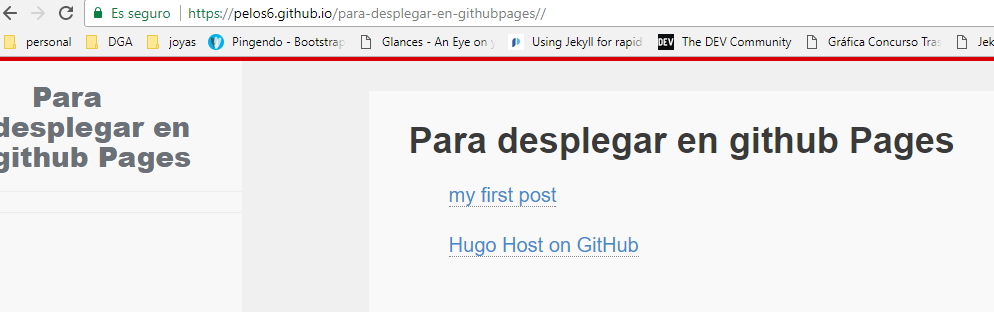

# despliegue de Hugo en GitHub Pages

* tutorial [de gohugo](https://gohugo.io/hosting-and-deployment/hosting-on-github/)
* otro [tutorial interesante](https://code.tutsplus.com/es/tutorials/make-creating-websites-fun-again-with-hugo-the-static-website-generator-written-in-go--cms-27319)

* primero creo un sitio con `hugo`

```bash
c:\nube\MEGA\programacion\HtmlCssEstatico\hugo>hugo new site para-desplegar-en-githubpages
Congratulations! Your new Hugo site is created in c:\nube\MEGA\programacion\HtmlCssEstatico\hugo\para-desplegar-en-githubpages.

Just a few more steps and youre ready to go:

1. Download a theme into the same-named folder.
   Choose a theme from https://themes.gohugo.io/, or
   create your own with the "hugo new theme <THEMENAME>" command.
2. Perhaps you want to add some content. You can add single files
   with "hugo new <SECTIONNAME>\<FILENAME>.<FORMAT>".
3. Start the built-in live server via "hugo server".

Visit https://gohugo.io/ for quickstart guide and full documentation.

c:\nube\MEGA\programacion\HtmlCssEstatico\hugo\para-desplegar-en-githubpages>git clone https://github.com/spf13/herring-cove.git themes/herring-cove

-- quitando .git del tema
c:\nube\MEGA\programacion\HtmlCssEstatico\hugo\para-desplegar-en-githubpages>rm -rf themes/herring-cove/.git

-- creo el primer post
c:\nube\MEGA\programacion\HtmlCssEstatico\hugo\para-desplegar-en-githubpages>hugo new posts/my-first-post.md
c:\nube\MEGA\programacion\HtmlCssEstatico\hugo\para-desplegar-en-githubpages\content\posts\my-first-post.md created

c:\nube\MEGA\programacion\HtmlCssEstatico\hugo\para-desplegar-en-githubpages>hugo server -t herring-cove --buildDrafts

```

* cambio el archivo de configuración `config.toml`

```toml
baseURL = "https://pelos6.github.io/para-desplegar-en-githubpages/"
languageCode = "en-us"
theme = "herring-cove"
title = "Para desplegar en gitHub Pages"
publishDir = "docs"
```

* importante la línea donde pone `baseURL = "https://pelos6.github.io/para-desplegar-en-githubpages/"` con el protocolo `https\\` pues ni no es así no se cargan correctamente ni los `css` ni los `js` ni el resto de páginas
* construyo el sitio con `hugo`

* creo el repositorio en `GitHub` y lo inicio en local

```bash
git init
git add -A
git commit -m "first commit"
git remote add origin https://github.com/pelos6/para-desplegar-en-githubpages.git
git push -u origin master
```

* en Settings → GitHub Pages seleccionar en `Source`
* `master branch /docs folder`. 
* Si la opción no esta habilitada es que no esta ese directorio creado.

* en el siguiente `push` se actualiza el directorio `docs` y se puede ver el sitio correctamente generado



